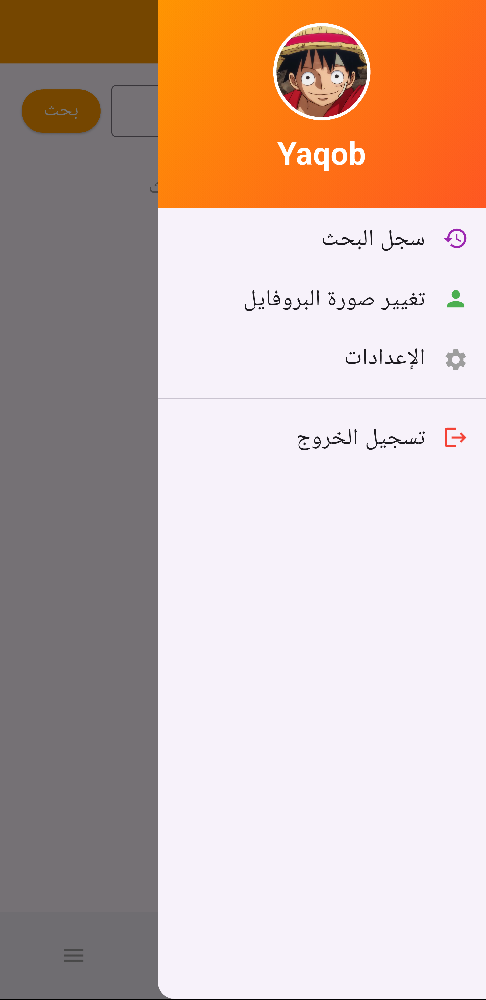
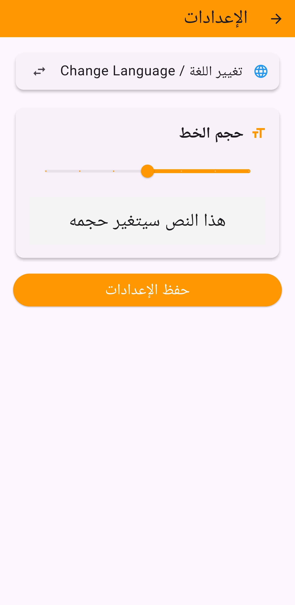
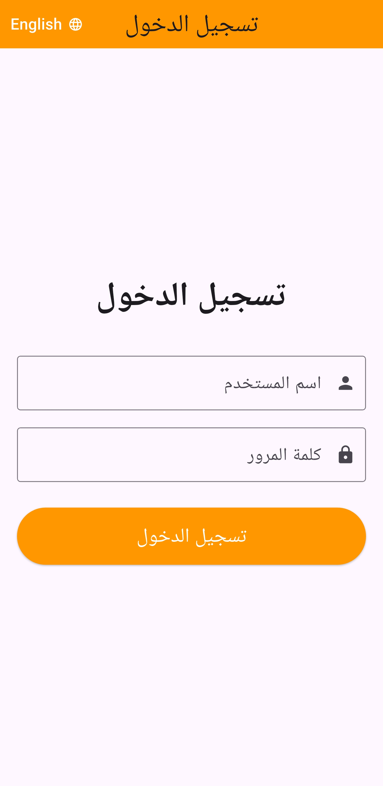

# 🦁 Brave Browser Clone

مشروع تطبيق "متصفح برايف" تم تطويره باستخدام إطار عمل **Flutter** ومكتبة **GetX** لإدارة الحالة، كجزء من متطلبات مقرر "برمجة تطبيقات الموبايل".

A mobile application project developed using **Flutter** and **GetX** architecture. It features a clean MVC pattern, full localization support (Arabic/English), and dynamic state management.

---

## 📸 Screenshots | صور التطبيق

| Home & Drawer | Settings (Ar) | Login Screen |
| :---: | :---: | :---: |
|  |  |  |

> **Note:** Please ensure screenshots are placed in the `images/` folder.


---

## 🚀 Key Features | المميزات الرئيسية

- **🏗 MVC Architecture:**
  - Code is organized into `Models`, `Views`, and `Controllers` using **GetX**.
  - فصل كامل بين التصميم (UI) والمنطق البرمجي (Logic).

- **🌍 Localization (Multi-language):**
  - Full support for **Arabic** and **English**.
  - Instant language switching without restarting the app.
  - دعم كامل للغتين العربية والإنجليزية مع تغيير فوري للنصوص واتجاه التطبيق (RTL/LTR).

- **⚙️ Dynamic Settings:**
  - **Font Size Control:** Users can scale the text size across the entire app.
  - **Profile Management:** Update profile picture using Camera or Gallery.
  - تحكم كامل بحجم الخط في التطبيق، وتغيير صورة البروفايل.

- **📱 Enhanced UI/UX:**
  - Custom Splash Screen.
  - Custom App Launcher Icon.
  - Dark/Light mode ready.

---

## 🛠 Tech Stack | التقنيات المستخدمة

- **Framework:** [Flutter](https://flutter.dev/)
- **Language:** [Dart](https://dart.dev/)
- **State Management:** [GetX](https://pub.dev/packages/get)
- **Assets:** Custom Icons & Images.

---

## 📂 Project Structure | هيكلة المشروع

```text
lib/
├── controllers/      # Logic & State Management (GetxControllers)
│   ├── auth_controller.dart
│   ├── home_controller.dart
│   └── settings_controller.dart
├── views/            # UI Screens
│   ├── home_screen.dart
│   ├── login_screen.dart
│   └── ...
├── utils/            # Helper files
│   └── translations.dart  # Dictionary for Ar/En strings
└── main.dart         # Entry point & Theme config
```

